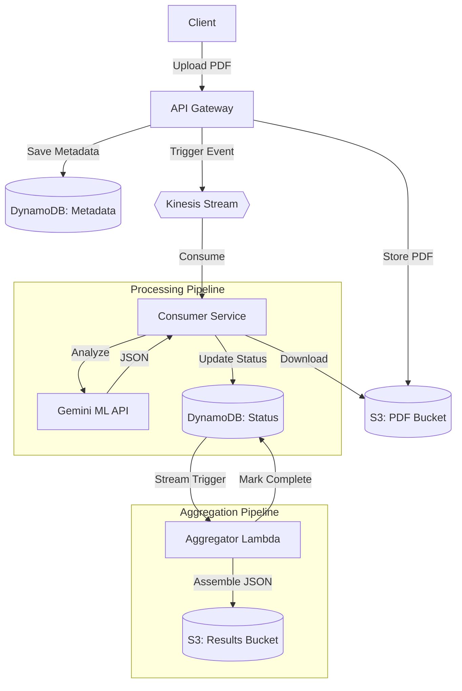

# Distributed ML Document Orchestrator

A horizontally scalable, multi-tenant API service for processing PDF documents through ML pipelines. Supports both synchronous (small files) and asynchronous (large files) processing workflows with intelligent chunking and parallel processing.

## Architecture Overview

The system follows an event-driven, microservices architecture optimized for AWS.



### Key Components
- **API Gateway**: Handles multi-tenant authentication, rate limiting, and PDF uploads.
- **Orchestrator**: Routes jobs to sync (small files) or async (large files) workflows.
- **Consumer Service**: Containerized service that extracts text page-by-page and performs parallel ML analysis via Gemini.
- **Aggregator Lambda**: Serverless function triggered by DynamoDB Streams to assemble final results once all chunks are processed.
- **DynamoDB Streams**: Captures status updates to trigger the final assembly automatically.

## Technology Stack

### Backend
- **NestJS** - TypeScript framework for API Gateway, Orchestrator & Workers
- **AWS ECS Fargate** - Containerized workers for chunk processing
- **AWS Lambda** - Final aggregation/assembly only
- **AWS SDK v3** - AWS service integrations

### AWS Services
- **S3** - PDF storage and results
- **DynamoDB** - Two tables: File Metadata + Document Status/Pages
- **Kinesis Data Streams** - Event streaming
- **ECS Fargate** - Containerized worker pool for chunk processing
- **Lambda** - Final aggregation only
- **Application Load Balancer** - Routes traffic to ECS services
- **CloudWatch** - Logging and monitoring

### ML Integration
- **Gemini API** - Document analysis including summarization, entity extraction, key point identification, and sentiment analysis.

---

## Getting Started

For detailed instructions on setting up the project locally or deploying to production, please refer to the following guides:

- [Local Development Guide](docs/DEVELOPMENT.md) - Setup **LocalStack (AWS Emulator)**, environment variables, and running tests.
- [Production Deployment Guide](docs/PRODUCTION.md) - AWS architecture, SAM/Terraform deployment, and security.

## Testing

### Unit & Integration Tests
```bash
npm run test
npm run test:integration
```

### E2E Tests
```bash
cd distributed-ml-document-orchestrator
node scripts/e2e-test.js
```

## Project Structure

```
Distributed-ML-Document-Orchestrator/
|-- docs/                     # Detailed Documentation
|-- distributed-ml-document-orchestrator/
|   |-- apps/
|   |   +-- distributed-ml-document-orchestrator/
|   |       |-- src/
|   |       |   |-- app/          # API Gateway & Controllers
|   |       |   |-- consumer/     # Kinesis Consumer & Document Chunker
|   |       |   |-- database/     # DynamoDB Services & Models
|   |       |   |-- ml/           # Gemini ML Integration Service
|   |       |   |-- queue/        # Kinesis Messaging Service
|   |       |   +-- storage/      # S3 Storage Service
|-- infrastructure/           # AWS Infrastructure (SAM/Terraform)
|-- scripts/                  # Utility & Initialization scripts
|-- docker-compose.yml        # LocalStack & Infrastructure setup
+-- README.md
```

## License

MIT License - see LICENSE file for details
