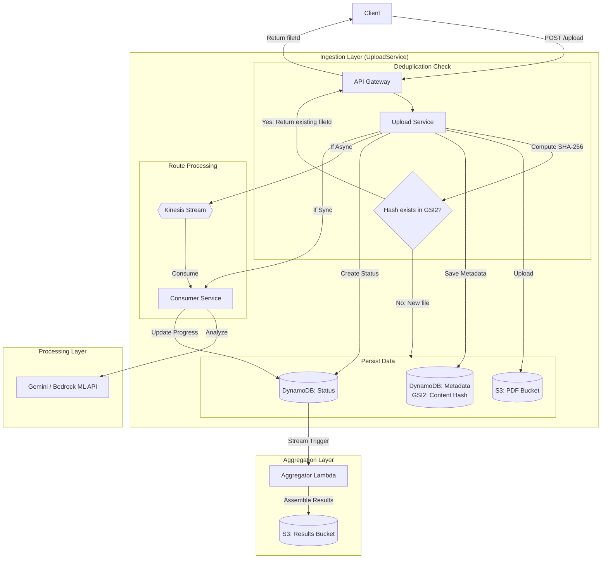

# Distributed ML Document Orchestrator
Multi-tenant PDF processing pipeline with parallel ML analysis.

## Problem Statement
Processing large volumes of PDF documents through ML models often hits scaling bottlenecks, high latency for large files, and reliability issues due to API timeouts or transient failures. This system orchestrates these workloads by separating synchronous ingestion from asynchronous processing.

## Real-World Constraint
**Latency vs. Reliability**: Synchronous processing is limited by the 29-second AWS API Gateway timeout. Any document requiring >20s of ML analysis must transition to the async boundary to ensure delivery.

## TL;DR
- **Horizontally Scalable**: Parallel processing of PDF pages via ECS Fargate.
- **Multi-tenant**: Strict data isolation using tenant-prefixed S3 paths and DynamoDB keys.
- **Resilient**: Event-driven architecture with Kinesis-backed retries and idempotency.
- **ML-Powered**: Native integration with Gemini API for document intelligence.
- **Serverless Aggregation**: Automatic result assembly via DynamoDB Streams and Lambda.

## Tech Stack

| Component | Technology |
|-----------|------------|
| **Runtime** | Node.js 18 LTS |
| **Framework** | NestJS 10.x |
| **API Layer** | ECS Fargate (long-running) |
| **Aggregation** | AWS Lambda (short-lived) |
| **State** | DynamoDB (status tracking, multi-tenant) |
| **Queue** | Kinesis Data Streams |
| **Storage** | S3 (PDFs + Results) |
| **ML** | Google Gemini API |
| **IaC** | SAM / Terraform |

## Architecture


```mermaid
flowchart TD
    Client["Client"] -- "POST /upload" --> API["API Gateway"]
    
    subgraph IngestionLayer ["Ingestion Layer (UploadService)"]
        API --> UploadService["Upload Service"]
        
        subgraph Deduplication ["Deduplication Check"]
            UploadService -- "Compute SHA-256" --> HashCheck{"Hash exists in GSI2?"}
            HashCheck -- "Yes: Return existing fileId" --> API
        end
        
        HashCheck -- "No: New file" --> StoreFlow
        
        subgraph StoreFlow ["Persist Data"]
            UploadService -- "Upload" --> S3_PDF[("S3: PDF Bucket")]
            UploadService -- "Save Metadata" --> DDB_Meta[("DynamoDB: Metadata<br/>GSI2: Content Hash")]
            UploadService -- "Create Status" --> DDB_Status[("DynamoDB: Status")]
        end
        
        subgraph RouteProcessing ["Route Processing"]
            UploadService -- "If Async" --> Kinesis{{"Kinesis Stream"}}
            UploadService -- "If Sync" --> Consumer["Consumer Service"]
        end
    end

    subgraph ProcessingLayer ["Processing Layer"]
        Kinesis -- "Consume" --> Consumer
        Consumer -- "Analyze" --> Gemini["Gemini / Bedrock ML API"]
        Consumer -- "Update Progress" --> DDB_Status
    end

    subgraph AggregationLayer ["Aggregation Layer"]
        DDB_Status -- "Stream Trigger" --> Aggregator["Aggregator Lambda"]
        Aggregator -- "Assemble Results" --> S3_Results[("S3: Results Bucket")]
    end

    API -- "Return fileId" --> Client
```

### Entry Point
- **REST API**: `POST /jobs` accepts PDF uploads and metadata.
- **Orchestrator**: Routes jobs to `sync` (small files) or `async` (large files) based on size thresholds.

### Async Boundary
- **Kinesis Data Streams**: Acts as the durable buffer between ingestion and processing. Once an event is in Kinesis, the system guarantees eventual processing.

### Deduplication & Idempotency
- **Content Hash Deduplication**: SHA-256 hash computed on upload; duplicate files return existing fileId without re-processing.
- **Idempotency**: Consumers use `jobId` + `pageNumber` to ensure re-processed events don't create duplicate results.
- **State Store**: DynamoDB tracks job status and page-level results with GSI2 for hash-based lookups.
- **Storage**: S3 provides 99.999999999% durability for source PDFs and final JSON results.

### Downstream Protection
- **Rate Limiting**: API Gateway throttles incoming requests per tenant.
- **Backpressure**: Kinesis consumers scale based on stream depth, preventing Gemini API exhaustion through controlled concurrency.

## Environment Hub

| Environment | Purpose | Documentation |
|-------------|---------|---------------|
| **Local** | Development & Integration Testing | [docs/DEVELOPMENT.md](docs/DEVELOPMENT.md) |
| **Production** | Scalable AWS Deployment | [docs/PRODUCTION.md](docs/PRODUCTION.md) |
| **Testing** | Quality Assurance | [docs/testing.md](docs/testing.md) |
| **Migration** | Infrastructure Evolution | [docs/migration.md](docs/migration.md) |
| **Observability** | Logging, Metrics, SLOs | [docs/observability.md](docs/observability.md) |
| **Security** | Authentication, Secrets | [docs/security.md](docs/security.md) |

## Key Design Decisions

### Why NestJS?
- **Type Safety**: Full TypeScript support with decorators for clean architecture.
- **Dependency Injection**: Built-in DI container for testability and modularity.
- **Microservice Patterns**: Native support for message queues, event-driven architecture.

### Why Kinesis over SQS?
- **Ordering Guarantees**: Partition keys by `jobId` ensure sequential chunk processing.
- **Replay Capability**: 24-hour retention for debugging and reprocessing.
- **High Throughput**: Better suited for high-velocity event streams.

### Why ECS Fargate for Consumers?
- **Long-Running Tasks**: No 15-minute Lambda timeout constraint.
- **Predictable Performance**: Dedicated vCPU/memory allocation.
- **Cost Efficiency**: Fargate Spot reduces compute costs by ~70%.

### Why Lambda for Aggregation?
- **Short-Lived**: Aggregation runs in <30 seconds, perfect for Lambda.
- **Event-Driven**: DynamoDB Streams trigger automatically on completion.
- **Cost**: Pay only when documents complete, not for idle time.

## How Scalability is Achieved

### 1. Parallel Page Processing
Each PDF page is processed independently. A 100-page document spawns 100 parallel Gemini API calls, reducing latency from O(n) to O(1) per job.

```typescript
// pages are processed in parallel, not sequentially
await Promise.all(pages.map(page => this.geminiService.analyze(page)));
```

### 2. Kinesis Partition Keys
Jobs are partitioned by `jobId`, ensuring ordered processing within a job while allowing parallelism across jobs.

```typescript
await kinesis.putRecord({
  StreamName: STREAM_NAME,
  PartitionKey: jobId, // All pages for same job go to same shard
  Data: JSON.stringify(event),
});
```

### 3. Idempotency via DynamoDB
`jobId + pageNumber` composite keys prevent duplicate results. Re-processed events overwrite rather than append.

```typescript
// Idempotent write - same key = update, not duplicate
await dynamodb.put({
  TableName: TABLE,
  Item: { PK: `JOB#${jobId}`, SK: `PAGE#${pageNumber}`, ...result }
});
```

### 4. Backpressure Management
Consumer concurrency is throttled via semaphores to respect Gemini API rate limits.

```typescript
const semaphore = new Semaphore(MAX_CONCURRENT_GEMINI_CALLS);
await semaphore.acquire();
try {
  await gemini.analyze(page);
} finally {
  semaphore.release();
}
```

## Scale & Limits

| Metric | Expected Value |
|--------|----------------|
| **Concurrent uploads** | 100+ |
| **Throughput (small docs)** | ~50 docs/min |
| **Pages per document** | Up to 500 |
| **First bottleneck** | Gemini API rate limits (RPM/TPM) |
| **Kinesis shards** | 1 (scales to 10+) |
| **Fargate tasks** | 1-10 (auto-scaled) |

### Non-Goals
- Real-time <1s latency for 100+ page documents
- OCR for handwritten text (relies on Gemini vision capabilities)

## Failure Modes

| Failure | System Response | Recovery |
|---------|-----------------|----------|
| **Gemini Timeout** | Consumer retries with exponential backoff | Automatic via Kinesis retry policy |
| **Consumer Crash** | Kinesis checkpointing ensures no data loss | New ECS task picks up from last checkpoint |
| **S3 Outage** | API returns 503; ingestion halts | Manual retry once AWS service restores |
| **DynamoDB Throttle** | On-demand billing auto-scales | Automatic; monitor `UserErrors` metric |

## Quickstart (Local)

### Prerequisites

| Tool | Version | Purpose |
|------|---------|---------|
| Node.js | 18+ | Runtime |
| Docker | 24.x+ | LocalStack containers |
| Gemini API Key | - | ML processing |

### Run

```bash
# Start LocalStack
docker-compose up -d

# Initialize AWS resources
npm run init:local

# Start development server
npm run dev
```

### Test

```bash
# Unit tests
npm run test

# Integration tests (requires LocalStack)
npm run test:integration
```

## Project Structure

```
Distributed-ML-Document-Orchestrator/
├── distributed-ml-document-orchestrator/
│   ├── apps/
│   │   └── distributed-ml-document-orchestrator/
│   │       └── src/
│   │           ├── app/              # API controllers
│   │           ├── aggregator/       # Lambda aggregation logic
│   │           ├── consumer/         # Kinesis consumer service
│   │           ├── database/         # DynamoDB services
│   │           ├── ml/               # Gemini integration
│   │           ├── queue/            # Kinesis producer/consumer
│   │           └── storage/          # S3 services
│   └── scripts/                      # E2E test scripts
├── docs/                             # Documentation
├── infrastructure/
│   ├── template.yaml                 # SAM template
│   └── terraform/                    # Terraform alternative
├── docker-compose.yml                # LocalStack configuration
└── .env.example                      # Environment template
```

## License

MIT

---
**Note**: This project maintains strict separation between local emulation (LocalStack) and production AWS infrastructure.
