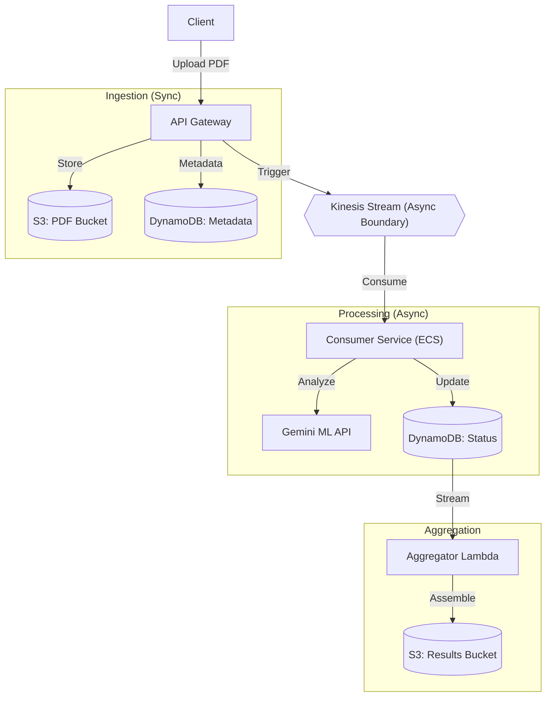

# Distributed ML Document Orchestrator
Multi-tenant PDF processing pipeline with parallel ML analysis.

## The Problem
Processing large volumes of PDF documents through ML models often hits scaling bottlenecks, high latency for large files, and reliability issues due to API timeouts or transient failures. This system orchestrates these workloads by separating synchronous ingestion from asynchronous processing.

## Real-World Constraint
**Latency vs. Reliability**: Synchronous processing is limited by the 29-second AWS API Gateway timeout. Any document requiring >20s of ML analysis must transition to the async boundary to ensure delivery.

## TL;DR
- **Horizontally Scalable**: Parallel processing of PDF pages via ECS Fargate.
- **Multi-tenant**: Strict data isolation using tenant-prefixed S3 paths and DynamoDB keys.
- **Resilient**: Event-driven architecture with Kinesis-backed retries and idempotency.
- **ML-Powered**: Native integration with Gemini API for document intelligence.
- **Serverless Aggregation**: Automatic result assembly via DynamoDB Streams and Lambda.

## System Architecture

### Entry Point
- **REST API**: `POST /jobs` accepts PDF uploads and metadata.
- **Orchestrator**: Routes jobs to `sync` (small files) or `async` (large files) based on size thresholds.

### Async Boundary
- **Kinesis Data Streams**: Acts as the durable buffer between ingestion and processing. Once an event is in Kinesis, the system guarantees eventual processing.

### Durability & Idempotency
- **State Store**: DynamoDB tracks job status and page-level results.
- **Idempotency**: Consumers use `jobId` + `pageNumber` to ensure re-processed events don't create duplicate results.
- **Storage**: S3 provides 99.999999999% durability for source PDFs and final JSON results.

### Downstream Protection
- **Rate Limiting**: API Gateway throttles incoming requests per tenant.
- **Backpressure**: Kinesis consumers scale based on stream depth, preventing Gemini API exhaustion through controlled concurrency.

## Environment Hub

| Environment | Purpose | Documentation |
| :--- | :--- | :--- |
| **Local** | Development & Integration Testing | [DEVELOPMENT.md](docs/DEVELOPMENT.md) |
| **Production** | Scalable AWS Deployment | [PRODUCTION.md](docs/PRODUCTION.md) |
| **Migration** | Infrastructure Evolution | [docs/migration.md](docs/migration.md) |

## Architecture Diagram


```mermaid
flowchart TD
    Client["Client"] -- "Upload PDF" --> API["API Gateway"]
    
    subgraph Ingestion ["Ingestion (Sync)"]
        API -- "Store" --> S3_PDF[("S3: PDF Bucket")]
        API -- "Metadata" --> DDB_Meta[("DynamoDB: Metadata")]
    end

    API -- "Trigger" --> Kinesis{{"Kinesis Stream (Async Boundary)"}}

    subgraph Processing ["Processing (Async)"]
        direction TB
        Consumer["Consumer Service (ECS)"]
        Gemini["Gemini ML API"]
        DDB_Status[("DynamoDB: Status")]
    end

    Kinesis -- "Consume" --> Consumer
    Consumer -- "Analyze" --> Gemini
    Consumer -- "Update" --> DDB_Status

    subgraph Aggregation ["Aggregation"]
        Aggregator["Aggregator Lambda"]
        S3_Results[("S3: Results Bucket")]
    end

    DDB_Status -- "Stream" --> Aggregator
    Aggregator -- "Assemble" --> S3_Results
```

## Key Design Decisions

| Decision | Rationale |
| :--- | :--- |
| **Tech Stack** | NestJS for type-safety; ECS Fargate for long-running compute; Lambda for short-lived aggregation. |
| **Ordering** | Kinesis Partition Keys (by `jobId`) ensure sequential processing of chunks if required, though pages are processed in parallel. |
| **Concurrency** | ECS task scaling handles burst traffic; Gemini rate limits are managed via consumer-side semaphore/throttling. |

## Scale & Limits

- **Expected Traffic**: Designed for 100+ concurrent document uploads.
- **First Bottleneck**: Gemini API rate limits (RPM/TPM).
- **Non-Goals**: Real-time <1s latency for 100+ page documents; OCR for handwritten text (relies on Gemini vision).

## Failure Modes

| Failure | System Response | Recovery |
| :--- | :--- | :--- |
| **Gemini Timeout** | Consumer retries with exponential backoff. | Automatic via Kinesis retry policy. |
| **Consumer Crash** | Kinesis checkpointing ensures no data loss. | New ECS task picks up from last checkpoint. |
| **S3 Outage** | API returns 503; ingestion halts. | Manual retry once AWS service restores. |

## Quickstart (Local)

### Prerequisites
- Node.js 18+, Docker, Gemini API Key.

### Run
```bash
docker-compose up -d && npm run init:local && npm run dev
```

### Test
```bash
npm run test:integration
```

---
**Note**: This project maintains strict separation between local emulation (LocalStack) and production AWS infrastructure.

