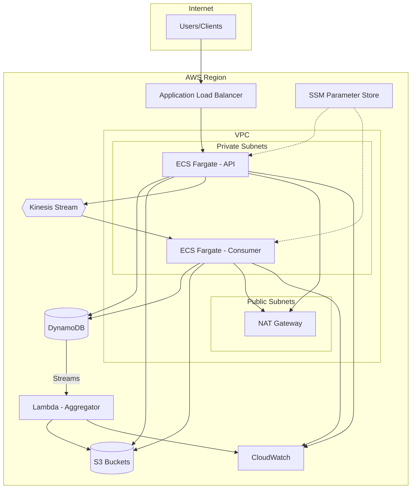

# Production Deployment Guide

This document provides detailed information on deploying the Distributed ML Document Orchestrator to AWS and managing the production environment.

## Infrastructure Overview



## Infrastructure Requirements

| Component | Specification |
|-----------|---------------|
| **ECS Fargate (API)** | 0.5 vCPU, 1 GB RAM (auto-scale to 10 tasks) |
| **ECS Fargate (Consumer)** | 0.5 vCPU, 1 GB RAM (auto-scale based on Kinesis depth) |
| **Lambda (Worker)** | 512 MB, 50 reserved concurrent executions |
| **Lambda (Aggregator)** | 512 MB, triggered by DynamoDB Streams |
| **DynamoDB** | On-Demand (PAY_PER_REQUEST), GSI for tenant queries |
| **Kinesis** | 1 shard minimum (scale to 10 based on throughput) |
| **S3** | AES-256 encryption, lifecycle policies |
| **VPC** | 2+ AZs, public + private subnets |

## Environment Variables

Production environment variables stored in AWS SSM Parameter Store:

```env
# Application
NODE_ENV=production
PORT=3000

# AWS (retrieved via IAM Task Roles - no static credentials)
AWS_REGION=us-east-1

# S3 (from CloudFormation/Terraform outputs)
S3_BUCKET_NAME=<stack-name>-pdfs-production
S3_RESULTS_BUCKET=<stack-name>-results-production

# DynamoDB
DYNAMODB_TABLE_NAME=<stack-name>-documents-production

# Kinesis
KINESIS_STREAM_NAME=<stack-name>-processing-production

# LLM Provider Configuration
# Option 1: Gemini (for development/testing)
LLM_PROVIDER=gemini
GEMINI_API_KEY=<from-ssm-parameter-store>
GEMINI_MODEL=gemini-1.5-flash

# Option 2: AWS Bedrock (recommended for production)
# LLM_PROVIDER=bedrock
# BEDROCK_MODEL=anthropic.claude-3-sonnet-20240229-v1:0
# No API key needed - uses IAM Task Role authentication

# Tuning
FILE_SIZE_THRESHOLD_MB=2

# Logging
LOG_LEVEL=info
```

## LLM Provider Configuration

The system supports multiple LLM providers via a pluggable architecture:

| Provider | Authentication | Best For | Models |
|----------|---------------|----------|--------|
| **Gemini** | API Key | Development, testing | gemini-1.5-flash, gemini-pro |
| **Bedrock** | IAM Task Role | Production | Claude, Llama, Titan |

### Using AWS Bedrock in Production (Recommended)

Bedrock uses IAM authentication - no API keys in environment variables:

1. **Set the provider:**
   ```bash
   LLM_PROVIDER=bedrock
   BEDROCK_MODEL=anthropic.claude-3-sonnet-20240229-v1:0
   ```

2. **IAM Permissions (automatically configured):**
   The ECS Task Role has `bedrock:InvokeModel` permission for supported models.

3. **Benefits:**
   - No API keys to manage or rotate
   - IAM access logging and auditing
   - VPC endpoint support for private connectivity
   - Pay-per-use pricing

### Using Gemini for Development

For local development with LocalStack:

1. **Get API key:** https://ai.google.dev/
2. **Set environment variables:**
   ```bash
   LLM_PROVIDER=gemini
   GEMINI_API_KEY=your_key_here
   ```

## Deployment Options

### Option 1: AWS SAM (Serverless Application Model)

**1. Install SAM CLI:**
```bash
brew install aws-sam-cli  # macOS
# or
pip install aws-sam-cli
```

**2. Deploy Infrastructure:**
```bash
# Build
sam build

# Deploy (first time - guided)
sam deploy --guided

# Subsequent deploys
sam deploy
```

**3. SAM will create:**
- S3 buckets (with encryption and lifecycle rules)
- DynamoDB tables (with GSI, Streams, and TTL)
- Kinesis Data Stream (with KMS encryption)
- Lambda functions for workers and aggregation
- ECS Fargate services for API Gateway & Consumer
- **IAM Roles & Policies** (Task Roles vs. Execution Roles)
- **SSM Parameter Store** (for secure secret management)
- CloudWatch Log Groups & Alarms
- VPC, Subnets, and Security Groups

---

### Option 2: Terraform

Terraform provides a more granular approach to infrastructure management, ideal for complex multi-account setups.

**1. Initialize Terraform:**
```bash
cd infrastructure/terraform
terraform init
```

**2. Configure variables:**
```bash
cp terraform.tfvars.example terraform.tfvars
# Edit terraform.tfvars with your GEMINI_API_KEY and other settings
```

**3. Deploy:**
```bash
terraform plan
terraform apply
```

**4. Terraform will create:**
- **Networking**: VPC, Public Subnets, Internet Gateway, Route Tables
- **Load Balancing**: Application Load Balancer with Target Groups
- **Compute**: ECS Fargate Cluster and Service with auto-scaling
- **Serverless**: Worker and Aggregator Lambda functions
- **Storage & DB**: S3 buckets (encrypted) and DynamoDB (with GSI and Streams)
- **Security**: Granular IAM Roles and SSM Parameter Store for secrets

## Health Checks

### ALB Health Check

```yaml
# CloudFormation/CDK configuration
HealthCheck:
  Path: /health
  Protocol: HTTP
  Port: 3000
  HealthyThresholdCount: 2
  UnhealthyThresholdCount: 3
  Interval: 30
  Timeout: 5
```

### Container Health Check

```dockerfile
HEALTHCHECK --interval=30s --timeout=5s --start-period=10s --retries=3 \
  CMD curl -f http://localhost:3000/health || exit 1
```

## Scaling Strategy

### ECS Auto Scaling

```yaml
# Target tracking based on CPU utilization
ScalingPolicy:
  TargetValue: 70
  ScaleInCooldown: 300
  ScaleOutCooldown: 60
  PredefinedMetricType: ECSServiceAverageCPUUtilization

# Min/Max tasks
DesiredCount: 2
MinCapacity: 1
MaxCapacity: 10
```

### Lambda Concurrency

| Function | Reserved Concurrency | Rationale |
|----------|---------------------|-----------|
| Worker | 50 | Match Gemini API rate limits |
| Aggregator | 10 | Low-frequency, triggered by completions |

### Kinesis Scaling

| Shards | Throughput | When to Scale |
|--------|------------|---------------|
| 1 | 1 MB/s write, 2 MB/s read | Default |
| 5 | 5 MB/s write, 10 MB/s read | >100 concurrent uploads |
| 10 | 10 MB/s write, 20 MB/s read | High-volume batch processing |

## Multi-Tenancy & Data Isolation

The system is built with a multi-tenant architecture, ensuring strict data isolation.

| Isolation Layer | Implementation |
|-----------------|----------------|
| **Storage (S3)** | Path prefix: `s3://bucket/{tenantId}/{fileId}/...` |
| **Database (DynamoDB)** | PK includes `TENANT#{tenantId}` |
| **API Security** | Every request requires `x-tenant-id` header |

## Client & Frontend Integration

### 1. Authentication

| Method | Use Case | Implementation |
|--------|----------|----------------|
| API Keys | Server-to-server | `X-API-Key` header |
| JWT | User-facing frontend | `Authorization: Bearer <token>` |
| Cognito | Production-grade user management | Validate JWTs from provider |

### 2. CORS Configuration

```typescript
// main.ts
app.enableCors({
  origin: 'https://your-frontend-domain.com',
  methods: 'GET,HEAD,PUT,PATCH,POST,DELETE',
  credentials: true,
});
```

### 3. Efficient File Uploads

For large PDFs, avoid proxying through the API:
1. Client requests a **Presigned Upload URL** from the API
2. Client uploads directly to S3
3. Client notifies the API to trigger processing

### 4. Real-time Updates

| Method | Complexity | Use Case |
|--------|------------|----------|
| Polling | Low | Simple integrations |
| WebSockets | Medium | Real-time dashboards |
| Webhooks | Low | Backend-to-backend |

## Tuning & Thresholds

### Synchronous vs. Asynchronous

| Use Case | Threshold | Rationale |
|----------|-----------|-----------|
| **Standard Web App** | 1-2 MB | Snappy UX for small PDFs |
| **Batch Processing** | 0 MB | Always async; most resilient |
| **High Performance** | 5 MB | Only with Gemini Flash model |

### Latency Factors

| Factor | Typical Duration |
|--------|------------------|
| Gemini API | 3-5 seconds per page |
| PDF Parsing | 100-500ms per page |
| S3 Upload/Download | 50-200ms (depends on size) |

## Cost Optimization

### Free Tier Usage
- **S3**: 5GB storage, 20K GET, 2K PUT/month
- **DynamoDB**: 25GB storage, 25 RCU/WCU
- **Lambda**: 1M requests, 400K GB-seconds/month

### Estimated Monthly Costs (beyond free tier)

| Service | Cost |
|---------|------|
| Kinesis Data Streams (1 shard) | ~$11 |
| Lambda (moderate usage) | $0-5 |
| ECS Fargate (2 tasks) | ~$30-40 |
| Data transfer | ~$5-10 |
| **Total** | **~$50-70/month** |

### Cost Reduction Tips
1. Use **Lambda for all services** (API Gateway + Orchestrator) - reduces ECS costs
2. Enable **DynamoDB auto-scaling** - pay only for what you use
3. Set **S3 lifecycle policies** - move old files to Glacier
4. Use **Fargate Spot** - up to 70% savings
5. Enable **DynamoDB TTL** - auto-delete old chunks

## Security & Compliance

See [docs/security.md](security.md) for detailed security documentation.

### Summary

| Security Aspect | Implementation |
|-----------------|----------------|
| **Credentials** | Zero static credentials; IAM Task Roles |
| **Secrets** | SSM Parameter Store with KMS encryption |
| **Encryption at Rest** | S3 AES-256, DynamoDB AWS-managed |
| **Encryption in Transit** | HTTPS/TLS 1.2+ |
| **Network** | VPC isolation, Security Groups |

## Monitoring & Alerts

### CloudWatch Alarms

| Alarm | Metric | Threshold |
|-------|--------|-----------|
| Worker Errors | `Lambda.Errors` | >10 in 5 min |
| DynamoDB Throttle | `UserErrors` | >5 in 5 min |
| Kinesis Iterator Age | `GetRecords.IteratorAgeMilliseconds` | >60000 (1 min lag) |
| ECS CPU High | `CPUUtilization` | >80% for 5 min |

See [docs/observability.md](observability.md) for SLIs/SLOs and detailed metrics.

---
**Note**: Always test deployments in a staging environment before applying to production.
