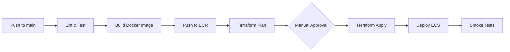

# CI/CD Pipeline

This document describes the automated deployment pipeline for the Distributed ML Document Orchestrator.

## Pipeline Overview



## GitHub Actions Workflow

Create `.github/workflows/deploy.yml`:

```yaml
name: Deploy to Production

on:
  push:
    branches: [main]
  pull_request:
    branches: [main]

env:
  AWS_REGION: us-east-1
  ECR_REPOSITORY: document-orchestrator
  ECS_CLUSTER: document-orchestrator-production-cluster
  ECS_SERVICE: document-orchestrator-production-service

jobs:
  test:
    runs-on: ubuntu-latest
    steps:
      - uses: actions/checkout@v4
      
      - name: Setup Node.js
        uses: actions/setup-node@v4
        with:
          node-version: '18'
          cache: 'npm'
      
      - name: Install dependencies
        run: npm ci
      
      - name: Lint
        run: npm run lint
      
      - name: Unit Tests
        run: npm run test

  build-and-push:
    needs: test
    if: github.ref == 'refs/heads/main'
    runs-on: ubuntu-latest
    permissions:
      id-token: write  # Required for OIDC
      contents: read
    outputs:
      image: ${{ steps.build-image.outputs.image }}
    steps:
      - uses: actions/checkout@v4
      
      - name: Configure AWS credentials (OIDC)
        uses: aws-actions/configure-aws-credentials@v4
        with:
          role-to-assume: arn:aws:iam::${{ secrets.AWS_ACCOUNT_ID }}:role/GitHubActionsDeployRole
          aws-region: ${{ env.AWS_REGION }}
      
      - name: Login to Amazon ECR
        id: login-ecr
        uses: aws-actions/amazon-ecr-login@v2
      
      - name: Build and push Docker image
        id: build-image
        env:
          ECR_REGISTRY: ${{ steps.login-ecr.outputs.registry }}
          IMAGE_TAG: ${{ github.sha }}
        run: |
          docker build -t $ECR_REGISTRY/$ECR_REPOSITORY:$IMAGE_TAG .
          docker push $ECR_REGISTRY/$ECR_REPOSITORY:$IMAGE_TAG
          echo "image=$ECR_REGISTRY/$ECR_REPOSITORY:$IMAGE_TAG" >> $GITHUB_OUTPUT

  terraform:
    needs: build-and-push
    runs-on: ubuntu-latest
    permissions:
      id-token: write
      contents: read
    environment: production  # Requires manual approval
    steps:
      - uses: actions/checkout@v4
      
      - name: Configure AWS credentials (OIDC)
        uses: aws-actions/configure-aws-credentials@v4
        with:
          role-to-assume: arn:aws:iam::${{ secrets.AWS_ACCOUNT_ID }}:role/GitHubActionsDeployRole
          aws-region: ${{ env.AWS_REGION }}
      
      - name: Setup Terraform
        uses: hashicorp/setup-terraform@v3
      
      - name: Terraform Init
        working-directory: infrastructure/terraform
        run: terraform init
      
      - name: Terraform Plan
        working-directory: infrastructure/terraform
        run: terraform plan -out=tfplan
      
      - name: Terraform Apply
        working-directory: infrastructure/terraform
        run: terraform apply -auto-approve tfplan

  deploy-ecs:
    needs: [build-and-push, terraform]
    runs-on: ubuntu-latest
    permissions:
      id-token: write
      contents: read
    steps:
      - name: Configure AWS credentials (OIDC)
        uses: aws-actions/configure-aws-credentials@v4
        with:
          role-to-assume: arn:aws:iam::${{ secrets.AWS_ACCOUNT_ID }}:role/GitHubActionsDeployRole
          aws-region: ${{ env.AWS_REGION }}
      
      - name: Deploy to ECS
        run: |
          aws ecs update-service \
            --cluster ${{ env.ECS_CLUSTER }} \
            --service ${{ env.ECS_SERVICE }} \
            --force-new-deployment
      
      - name: Wait for deployment
        run: |
          aws ecs wait services-stable \
            --cluster ${{ env.ECS_CLUSTER }} \
            --services ${{ env.ECS_SERVICE }}
```

## AWS OIDC Setup (One-Time)

Create an IAM Identity Provider and Role for GitHub Actions:

```bash
# 1. Create OIDC Provider (one-time per AWS account)
aws iam create-open-id-connect-provider \
  --url https://token.actions.githubusercontent.com \
  --client-id-list sts.amazonaws.com \
  --thumbprint-list 6938fd4d98bab03faadb97b34396831e3780aea1

# 2. Create IAM Role with trust policy for your repo
# See infrastructure/terraform/github-oidc.tf for full setup
```

## Required GitHub Secrets

| Secret | Description |
|--------|-------------|
| `AWS_ACCOUNT_ID` | Your AWS account ID (12 digits) |

> **Note:** No access keys needed! OIDC uses short-lived tokens.

## Environment Protection Rules

Configure in GitHub Settings → Environments → `production`:
- Required reviewers: Add team leads
- Wait timer: Optional 5-minute delay
