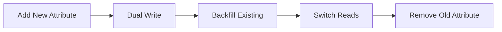

# Migration Guide

## Purpose

This document outlines the strategy for taking this codebase to production deployment, migrating between different infrastructure environments, and evolving system components without data loss or service interruption.

## Deploying to Production

### Prerequisites

Before deploying to production, ensure you have:

| Requirement | Description | How to Verify |
|-------------|-------------|---------------|
| AWS Account | With appropriate permissions | `aws sts get-caller-identity` |
| AWS CLI | Configured with credentials | `aws configure list` |
| SAM CLI or Terraform | Infrastructure tool installed | `sam --version` or `terraform --version` |
| Docker | For building container images | `docker --version` |
| Gemini API Key | For ML processing | Valid key from console.cloud.google.com |
| Domain (optional) | For custom domain | Route53 or external DNS |

### Step-by-Step Deployment

#### Step 1: Prepare Secrets

Store sensitive configuration in AWS SSM Parameter Store:

```bash
# Store Gemini API Key
aws ssm put-parameter \
  --name "/document-orchestrator/production/GEMINI_API_KEY" \
  --value "your-gemini-api-key" \
  --type "SecureString"

# Verify secret was stored
aws ssm get-parameter \
  --name "/document-orchestrator/production/GEMINI_API_KEY" \
  --with-decryption
```

#### Step 2: Build the Application

```bash
# Install dependencies
npm install

# Build the NestJS application
npm run build

# Verify build succeeded
ls -la distributed-ml-document-orchestrator/dist/
```

#### Step 3: Deploy Infrastructure (Choose SAM or Terraform)

**Option A: AWS SAM**

```bash
# Navigate to infrastructure
cd infrastructure

# Build SAM application
sam build

# Deploy (first time - guided setup)
sam deploy --guided

# You'll be prompted for:
# - Stack name: document-orchestrator-production
# - AWS Region: us-east-1
# - GeminiApiKey: (leave empty, we use SSM)
# - FileSizeThresholdMB: 2
# - Confirm changes before deploy: y
```

**Option B: Terraform**

```bash
# Navigate to Terraform directory
cd infrastructure/terraform

# Initialize Terraform
terraform init

# Create variables file
cp terraform.tfvars.example terraform.tfvars

# Edit terraform.tfvars with your values:
# - environment = "production"
# - gemini_api_key_ssm_path = "/document-orchestrator/production/GEMINI_API_KEY"

# Preview changes
terraform plan

# Deploy
terraform apply
```

#### Step 4: Build and Push Docker Image

```bash
# Get ECR repository URL from deployment outputs
ECR_REPO=$(aws cloudformation describe-stacks \
  --stack-name document-orchestrator-production \
  --query "Stacks[0].Outputs[?OutputKey=='ECRRepository'].OutputValue" \
  --output text)

# Authenticate Docker to ECR
aws ecr get-login-password --region us-east-1 | \
  docker login --username AWS --password-stdin $ECR_REPO

# Build Docker image
docker build -t document-orchestrator .

# Tag for ECR
docker tag document-orchestrator:latest $ECR_REPO:latest

# Push to ECR
docker push $ECR_REPO:latest
```

#### Step 5: Deploy ECS Services

```bash
# Force new deployment to pick up the new image
aws ecs update-service \
  --cluster document-orchestrator-production \
  --service api-service \
  --force-new-deployment

# Wait for deployment to complete
aws ecs wait services-stable \
  --cluster document-orchestrator-production \
  --services api-service
```

#### Step 6: Verify Deployment

```bash
# Get ALB URL from outputs
ALB_URL=$(aws cloudformation describe-stacks \
  --stack-name document-orchestrator-production \
  --query "Stacks[0].Outputs[?OutputKey=='LoadBalancerDNS'].OutputValue" \
  --output text)

# Health check
curl https://$ALB_URL/health

# Expected response: {"status":"ok"}
```

### Deployment Checklist

| Step | Command/Action | Verification |
|------|----------------|--------------|
| 1. Secrets stored | `aws ssm put-parameter ...` | `aws ssm get-parameter --with-decryption` |
| 2. Build app | `npm run build` | `dist/` folder exists |
| 3. Deploy infra | `sam deploy` or `terraform apply` | Stack created successfully |
| 4. Build image | `docker build -t app .` | Image built without errors |
| 5. Push to ECR | `docker push $ECR_REPO:latest` | Image visible in ECR console |
| 6. Deploy ECS | `aws ecs update-service --force-new-deployment` | Tasks running in ECS console |
| 7. Health check | `curl $ALB_URL/health` | Returns `{"status":"ok"}` |
| 8. Smoke test | `npm run test:smoke -- --url $ALB_URL` | All tests pass |

### Post-Deployment Configuration

#### Configure CloudWatch Alarms

```bash
# The SAM/Terraform deployment creates default alarms
# View them in CloudWatch console or:
aws cloudwatch describe-alarms \
  --alarm-name-prefix "document-orchestrator"
```

#### Set Up DNS (Optional)

```bash
# Create Route53 alias record pointing to ALB
aws route53 change-resource-record-sets \
  --hosted-zone-id YOUR_ZONE_ID \
  --change-batch '{
    "Changes": [{
      "Action": "CREATE",
      "ResourceRecordSet": {
        "Name": "api.yourdomain.com",
        "Type": "A",
        "AliasTarget": {
          "HostedZoneId": "ALB_HOSTED_ZONE_ID",
          "DNSName": "ALB_DNS_NAME",
          "EvaluateTargetHealth": true
        }
      }
    }]
  }'
```

### Production Environment Variables

These are automatically configured by SAM/Terraform:

| Variable | Source | Description |
|----------|--------|-------------|
| `NODE_ENV` | Hardcoded | `production` |
| `AWS_REGION` | ECS metadata | Region where deployed |
| `S3_BUCKET_NAME` | CloudFormation output | PDF storage bucket |
| `S3_RESULTS_BUCKET` | CloudFormation output | Results storage bucket |
| `DYNAMODB_TABLE_NAME` | CloudFormation output | Document status table |
| `KINESIS_STREAM_NAME` | CloudFormation output | Processing stream |
| `GEMINI_API_KEY` | SSM Parameter Store | Retrieved at runtime |
| `FILE_SIZE_THRESHOLD_MB` | Parameter | Sync/async threshold |

### Troubleshooting First Deployment

| Issue | Cause | Solution |
|-------|-------|----------|
| SAM deploy fails | Missing permissions | Ensure IAM user has CloudFormation, ECS, ECR, S3, DynamoDB, Kinesis permissions |
| ECS task won't start | Bad Docker image | Check CloudWatch Logs: `/aws/ecs/document-orchestrator` |
| Health check fails | App not starting | Verify `PORT` env var matches ALB target group |
| Gemini errors | Invalid API key | Verify SSM parameter path matches app config |
| 503 errors | ECS scaling | Wait for tasks to be `RUNNING` or increase `desiredCount` |

---

## Infrastructure Migration

### SAM to Terraform

The project supports both AWS SAM and Terraform. Migration from SAM to Terraform is recommended for production environments requiring granular networking control.

| Step | Command/Action | Notes |
|------|----------------|-------|
| 1. State Discovery | `aws cloudformation describe-stacks` | Identify existing resources |
| 2. Export Outputs | Copy S3 bucket names, DynamoDB table ARNs | Document all resource identifiers |
| 3. Terraform Import | `terraform import aws_s3_bucket.pdfs <bucket-name>` | Bring resources under TF management |
| 4. Validate State | `terraform plan` | Should show no changes |
| 5. Traffic Shift | Update ALB listener rules | Point to new ECS services |
| 6. Decommission | `sam delete` | Remove old CloudFormation stack |

### Import Commands Reference

```bash
# Import S3 buckets
terraform import aws_s3_bucket.pdfs document-orchestrator-pdfs-production
terraform import aws_s3_bucket.results document-orchestrator-results-production

# Import DynamoDB table
terraform import aws_dynamodb_table.documents DocumentOrchestrator-production

# Import Kinesis stream
terraform import aws_kinesis_stream.processing document-processing-stream
```

## Component Migration

### Local to Production

| Component | Local | Production | Migration Step |
|-----------|-------|------------|----------------|
| **Secrets** | `.env` file | SSM Parameter Store | `aws ssm put-parameter --name /app/GEMINI_API_KEY --value <key> --type SecureString` |
| **Networking** | Docker bridge | AWS VPC | Deploy VPC via SAM/Terraform |
| **Compute** | Local Node.js | ECS Fargate | Build Docker image, push to ECR |
| **Credentials** | Static keys | IAM Task Roles | Remove env vars, use SDK defaults |

### Secrets Migration

```bash
# Store secret in SSM Parameter Store
aws ssm put-parameter \
  --name "/document-orchestrator/production/GEMINI_API_KEY" \
  --value "your-api-key" \
  --type "SecureString" \
  --overwrite

# Verify
aws ssm get-parameter \
  --name "/document-orchestrator/production/GEMINI_API_KEY" \
  --with-decryption
```

## Data Migration

### DynamoDB Schema Changes

Use the **Expand and Contract** pattern for zero-downtime migrations.



#### Step 1: Add New Attribute (Expand)

```typescript
// Application code writes to BOTH old and new attributes
await dynamodb.put({
  TableName: TABLE,
  Item: {
    PK: `JOB#${jobId}`,
    SK: `STATUS`,
    status: 'processing',       // Old attribute
    overallStatus: 'processing', // New attribute (added)
  }
});
```

#### Step 2: Backfill Existing Records

```typescript
// Migration script
const items = await dynamodb.scan({ TableName: TABLE });

for (const item of items.Items) {
  if (!item.overallStatus) {
    await dynamodb.update({
      TableName: TABLE,
      Key: { PK: item.PK, SK: item.SK },
      UpdateExpression: 'SET overallStatus = :status',
      ExpressionAttributeValues: { ':status': item.status }
    });
  }
}
```

#### Step 3: Switch Reads (Contract)

```typescript
// Update application to read from new attribute
const result = await dynamodb.get({
  TableName: TABLE,
  Key: { PK: `JOB#${jobId}`, SK: 'STATUS' }
});

const status = result.Item.overallStatus; // Now using new attribute
```

#### Step 4: Remove Old Attribute

```typescript
// After verification, remove old attribute writes
await dynamodb.put({
  TableName: TABLE,
  Item: {
    PK: `JOB#${jobId}`,
    SK: `STATUS`,
    overallStatus: 'processing', // Only new attribute
  }
});
```

### Adding a Global Secondary Index (GSI)

```bash
# Add GSI via AWS CLI
aws dynamodb update-table \
  --table-name DocumentOrchestrator-production \
  --attribute-definitions AttributeName=GSI2PK,AttributeType=S AttributeName=GSI2SK,AttributeType=S \
  --global-secondary-index-updates \
    "[{\"Create\":{\"IndexName\":\"GSI2\",\"KeySchema\":[{\"AttributeName\":\"GSI2PK\",\"KeyType\":\"HASH\"},{\"AttributeName\":\"GSI2SK\",\"KeyType\":\"RANGE\"}],\"Projection\":{\"ProjectionType\":\"ALL\"}}}]"
```

> **Note:** GSI creation is an online operation but may take time for large tables.

## Kinesis Migration

### Scaling Shards

| Current Shards | Target Shards | Method |
|----------------|---------------|--------|
| 1 | 2 | `UpdateShardCount` (split) |
| 2 | 4 | `UpdateShardCount` (split) |
| 4 | 2 | `UpdateShardCount` (merge) |

```bash
# Scale from 1 to 2 shards
aws kinesis update-shard-count \
  --stream-name document-processing-stream \
  --target-shard-count 2 \
  --scaling-type UNIFORM_SCALING
```

### Consumer Migration

When changing consumer logic:

1. **Deploy new consumer** alongside existing
2. **Verify processing** via CloudWatch logs
3. **Stop old consumer** once validated
4. **Clean up** old ECS task definition

## Rollback Procedures

### Application Rollback

| Scenario | Action |
|----------|--------|
| Bad ECS deployment | ECS auto-rolls back on health check failure |
| Bad Lambda deployment | `aws lambda update-function-code --function-name <name> --s3-bucket <bucket> --s3-key <previous-version>` |
| Database schema issue | Restore from DynamoDB Point-in-Time Recovery |

### Point-in-Time Recovery

```bash
# Restore DynamoDB table to specific time
aws dynamodb restore-table-to-point-in-time \
  --source-table-name DocumentOrchestrator-production \
  --target-table-name DocumentOrchestrator-production-restored \
  --restore-date-time "2024-01-15T10:00:00Z"
```

---
**Note**: All migrations must be verified in the staging environment before applying to production.
