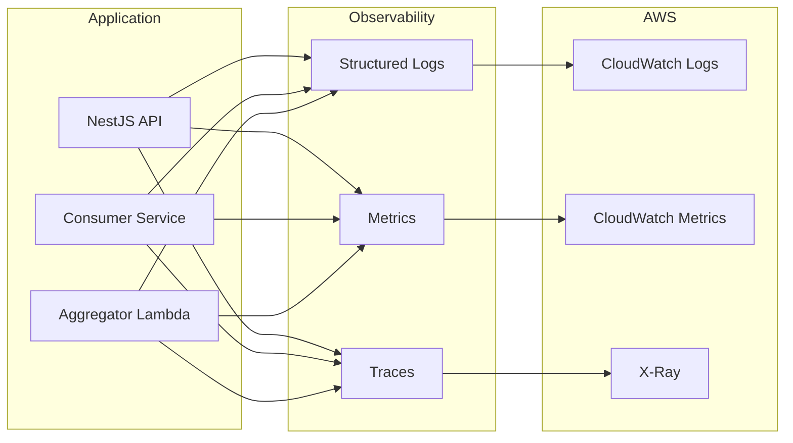

# Observability Guide

## Overview



## Structured Logging

### Configuration

The application uses JSON-structured logs in production for CloudWatch Logs Insights queries.

```typescript
// logger.service.ts
import { ConsoleLogger } from '@nestjs/common';

export class StructuredLogger extends ConsoleLogger {
  log(message: string, context?: string) {
    const logEntry = {
      level: 'INFO',
      timestamp: new Date().toISOString(),
      message,
      context,
      service: 'document-orchestrator',
    };
    console.log(JSON.stringify(logEntry));
  }
}
```

### Log Format

| Environment | Format | Example |
|-------------|--------|---------|
| Local | Pretty-printed | `[NestJS] INFO - Processing job abc123` |
| Production | JSON | `{"level":"INFO","message":"Processing job abc123","jobId":"abc123"}` |

### Log Levels

| Level | Usage |
|-------|-------|
| `ERROR` | Unrecoverable failures, exceptions |
| `WARN` | Recoverable issues, retries |
| `INFO` | Business events (job started, completed) |
| `DEBUG` | Detailed processing info (local only) |

### Correlation IDs

Every request receives a correlation ID for tracing across services:

```typescript
// Middleware adds correlationId to all logs
{
  "level": "INFO",
  "message": "Processing page 3 of 10",
  "correlationId": "req-abc123",
  "jobId": "job-xyz789"
}
```

### PII Redaction

Sensitive fields are redacted before logging:

```typescript
const redactedFields = ['email', 'ssn', 'password'];
// Logs show: {"email": "[REDACTED]", ...}
```

## Metrics Collection

### Key Metrics

| Metric | Type | Description |
|--------|------|-------------|
| `job.created` | Counter | Total jobs submitted |
| `job.completed` | Counter | Successfully completed jobs |
| `job.failed` | Counter | Failed jobs |
| `job.duration_seconds` | Histogram | End-to-end job processing time |
| `page.processed` | Counter | Total pages analyzed |
| `gemini.latency_seconds` | Histogram | Gemini API response time |
| `gemini.errors` | Counter | Gemini API errors by type |
| `kinesis.lag_seconds` | Gauge | Consumer lag behind stream |

### Custom Metrics (CloudWatch EMF)

```typescript
// Publish custom metric using CloudWatch Embedded Metric Format
import { MetricsLogger } from 'aws-embedded-metrics';

async function publishMetric(name: string, value: number, unit: string) {
  const metrics = new MetricsLogger();
  metrics.setNamespace('DocumentOrchestrator');
  metrics.putMetric(name, value, unit);
  await metrics.flush();
}

// Usage
await publishMetric('JobDuration', 45.2, 'Seconds');
```

### CloudWatch Dashboard

```json
{
  "widgets": [
    {
      "type": "metric",
      "properties": {
        "title": "Job Throughput",
        "metrics": [
          ["DocumentOrchestrator", "job.created"],
          [".", "job.completed"],
          [".", "job.failed"]
        ],
        "period": 300
      }
    }
  ]
}
```

## Distributed Tracing

### AWS X-Ray Integration

```typescript
// main.ts
import * as AWSXRay from 'aws-xray-sdk-core';
import * as AWS from 'aws-sdk';

// Instrument AWS SDK
AWSXRay.captureAWS(AWS);

// All DynamoDB, S3, Kinesis calls are automatically traced
```

### Custom Segments

```typescript
const segment = AWSXRay.getSegment();
const subsegment = segment.addNewSubsegment('gemini-api-call');

try {
  const result = await geminiService.analyze(page);
  subsegment.addMetadata('pageNumber', page.number);
} catch (error) {
  subsegment.addError(error);
  throw error;
} finally {
  subsegment.close();
}
```

## Health Endpoints

| Endpoint | Purpose | Response |
|----------|---------|----------|
| `GET /health` | Overall health | `{"status": "ok"}` |
| `GET /health/ready` | Readiness probe | `{"status": "ready", "dependencies": {...}}` |
| `GET /health/live` | Liveness probe | `{"status": "alive"}` |

### Readiness Check Details

```json
{
  "status": "ready",
  "dependencies": {
    "dynamodb": { "status": "up", "latency": 12 },
    "s3": { "status": "up", "latency": 8 },
    "kinesis": { "status": "up", "latency": 15 }
  }
}
```

## SLIs and SLOs

### Service Level Indicators

| SLI | Measurement | Data Source |
|-----|-------------|-------------|
| **Availability** | % of successful `/health` checks | ALB target health |
| **Latency** | p50, p95, p99 job completion time | CloudWatch Metrics |
| **Error Rate** | % of failed processing jobs | Custom metric |
| **Throughput** | Jobs processed per minute | Custom metric |

### Service Level Objectives

| SLO | Target | Measurement Window |
|-----|--------|-------------------|
| Availability | 99.9% | 30 days |
| Latency (p95) | <30s per page | 30 days |
| Error Rate | <0.5% | 30 days |
| Throughput | >50 docs/min sustained | 30 days |

### Error Budget

```
Monthly Error Budget = 100% - SLO
For 99.9% availability: 0.1% = ~43 minutes/month of downtime allowed
```

## Alerting

### CloudWatch Alarms

| Alarm | Metric | Threshold | Action |
|-------|--------|-----------|--------|
| High Error Rate | `job.failed / job.created` | >1% for 5 min | SNS → PagerDuty |
| High Latency | `job.duration_seconds` p95 | >60s for 10 min | SNS → Slack |
| Consumer Lag | `kinesis.lag_seconds` | >300s for 5 min | SNS → Ops Team |
| Lambda Errors | `Lambda.Errors` | >10 in 5 min | SNS → PagerDuty |

### Alarm Configuration

```yaml
# CloudFormation
HighErrorRateAlarm:
  Type: AWS::CloudWatch::Alarm
  Properties:
    AlarmName: DocumentOrchestrator-HighErrorRate
    MetricName: job.failed
    Namespace: DocumentOrchestrator
    Statistic: Sum
    Period: 300
    EvaluationPeriods: 1
    Threshold: 10
    ComparisonOperator: GreaterThanThreshold
    AlarmActions:
      - !Ref AlertSNSTopic
```

## Local vs Production

### Local Testing

```bash
# Logs appear in console with pretty formatting
npm run dev

# Output:
# [Nest] 12345  - 01/20/2024, 10:30:00 AM     LOG [UploadController] Processing upload for tenant-123
```

### Production Configuration

| Aspect | Local | Production |
|--------|-------|------------|
| **Log Format** | Pretty console | JSON to CloudWatch |
| **Log Level** | DEBUG | INFO |
| **Metrics** | None | CloudWatch EMF |
| **Tracing** | None | X-Ray |
| **Alerts** | None | CloudWatch Alarms → SNS |

### Environment Variables

```env
# Local
LOG_LEVEL=debug
LOG_FORMAT=pretty

# Production
LOG_LEVEL=info
LOG_FORMAT=json
AWS_XRAY_DAEMON_ADDRESS=xray-daemon:2000
```

## CloudWatch Logs Insights Queries

### Find Failed Jobs

```sql
fields @timestamp, @message
| filter level = "ERROR"
| filter @message like /job/
| sort @timestamp desc
| limit 50
```

### Job Duration Analysis

```sql
fields @timestamp, jobId, duration
| filter message = "Job completed"
| stats avg(duration), max(duration), pct(duration, 95) by bin(1h)
```

### Gemini API Latency

```sql
fields @timestamp, latency
| filter message = "Gemini API response"
| stats avg(latency), pct(latency, 99) by bin(5m)
```

---
**Note**: All observability features require proper IAM permissions for CloudWatch, X-Ray, and SNS.
