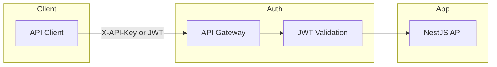
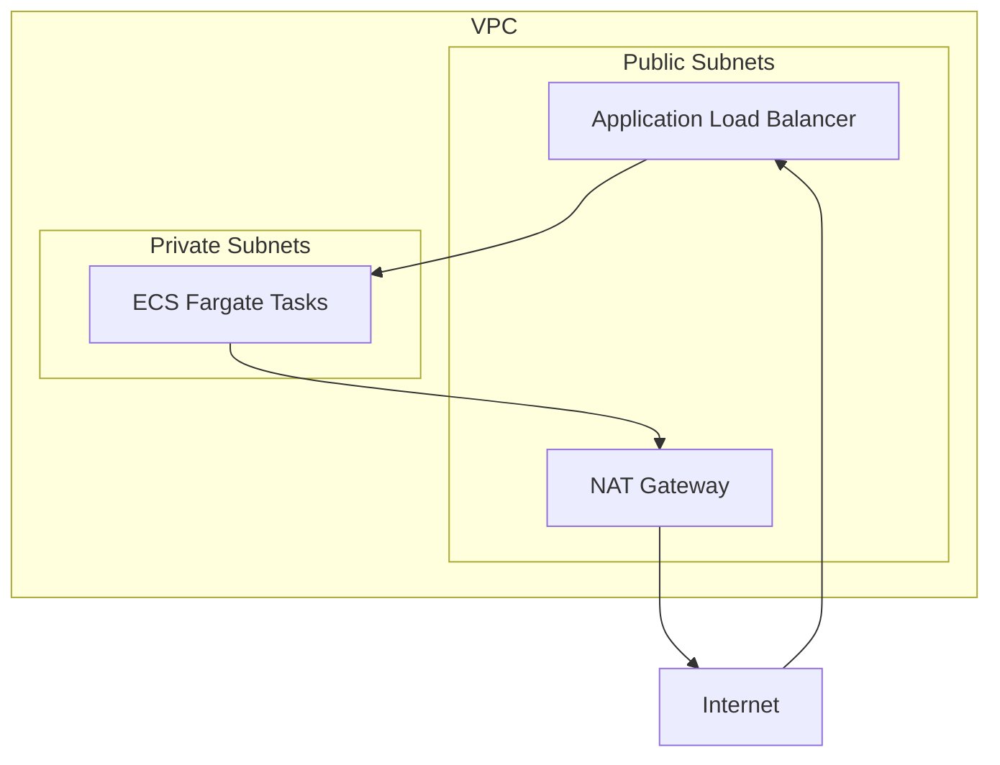

# Security Best Practices

## Authentication Overview

| Environment | Method | Implementation |
|-------------|--------|----------------|
| Local | API Key header | `X-API-Key` in `.env` |
| Production | IAM Task Roles | No static credentials |
| Frontend | JWT | `Authorization: Bearer <token>` |



## Identity & Access Management (IAM)

### Zero Static Credentials

**Critical:** No AWS Access Keys or Secret Keys are stored in the application or environment variables.

```typescript
// [CORRECT] SDK auto-discovers credentials from IAM Task Role
import { DynamoDBClient } from '@aws-sdk/client-dynamodb';
const client = new DynamoDBClient({ region: 'us-east-1' });

// [WRONG] Never hardcode credentials
const client = new DynamoDBClient({
  credentials: {
    accessKeyId: 'AKIA...',      // NEVER DO THIS
    secretAccessKey: '...',      // NEVER DO THIS
  }
});
```

### Task Role vs Execution Role

| Role Type | Used By | Permissions |
|-----------|---------|-------------|
| **Task Role** | Application code (NestJS) | S3, DynamoDB, Kinesis, SSM |
| **Execution Role** | ECS Agent | ECR pull, CloudWatch Logs |

```yaml
# SAM Template
ECSTaskRole:
  Type: AWS::IAM::Role
  Properties:
    Policies:
      - PolicyName: AppPermissions
        PolicyDocument:
          Statement:
            - Effect: Allow
              Action:
                - dynamodb:PutItem
                - dynamodb:GetItem
                - dynamodb:Query
              Resource: !GetAtt DocumentTable.Arn
```

### Least Privilege Policies

| Service | Allowed Actions | Resource Scope |
|---------|-----------------|----------------|
| DynamoDB | `PutItem`, `GetItem`, `UpdateItem`, `Query` | Specific table ARN |
| S3 | `PutObject`, `GetObject`, `ListBucket` | Specific bucket ARNs |
| Kinesis | `PutRecord`, `GetRecords` | Specific stream ARN |
| SSM | `GetParameter` | Specific parameter path |

## Secrets Management

### AWS SSM Parameter Store

Sensitive data like the `GEMINI_API_KEY` is stored securely in SSM Parameter Store.

```bash
# Store secret
aws ssm put-parameter \
  --name "/document-orchestrator/production/GEMINI_API_KEY" \
  --value "your-api-key" \
  --type "SecureString" \
  --overwrite
```

### Runtime Retrieval

```typescript
import { SSMClient, GetParameterCommand } from '@aws-sdk/client-ssm';

const ssm = new SSMClient({ region: 'us-east-1' });

async function getSecretApiKey(): Promise<string> {
  const response = await ssm.send(new GetParameterCommand({
    Name: '/document-orchestrator/production/GEMINI_API_KEY',
    WithDecryption: true,
  }));
  return response.Parameter?.Value || '';
}
```

### Secret Rotation

| Secret | Rotation Frequency | Method |
|--------|-------------------|--------|
| Gemini API Key | Manual (on compromise) | Update SSM, restart containers |
| JWT Secret | 90 days | Blue-green deployment |

## Multi-Tenancy & Data Isolation

### Storage Isolation (S3)

All files are prefixed with `tenantId`:

```
s3://bucket/
├── tenant-123/
│   ├── file-abc/
│   │   ├── original.pdf
│   │   └── results.json
│   └── file-def/
│       └── ...
└── tenant-456/
    └── ...
```

### Database Isolation (DynamoDB)

```typescript
// Partition Key includes tenantId
const item = {
  PK: `TENANT#${tenantId}#JOB#${jobId}`,
  SK: `STATUS`,
  // ...
};

// Query is scoped to tenant
const result = await dynamodb.query({
  TableName: TABLE,
  KeyConditionExpression: 'PK = :pk',
  ExpressionAttributeValues: {
    ':pk': `TENANT#${tenantId}#JOB#${jobId}`
  }
});
```

### API Security

Every request must include a tenant context:

```typescript
// Middleware validates tenant
@Injectable()
export class TenantMiddleware implements NestMiddleware {
  use(req: Request, res: Response, next: NextFunction) {
    const tenantId = req.headers['x-tenant-id'];
    if (!tenantId) {
      throw new UnauthorizedException('Missing tenant ID');
    }
    req['tenantId'] = tenantId;
    next();
  }
}
```

## Data Protection

### Encryption at Rest

| Service | Encryption | Key Management |
|---------|------------|----------------|
| S3 | AES-256 (SSE-S3) | AWS-managed |
| DynamoDB | AES-256 | AWS-managed |
| Kinesis | KMS | `alias/aws/kinesis` |
| SSM Parameters | KMS | AWS-managed or custom CMK |

### Encryption in Transit

| Connection | Protocol | Minimum Version |
|------------|----------|-----------------|
| API → Client | HTTPS | TLS 1.2 |
| ECS → DynamoDB | HTTPS | TLS 1.2 |
| ECS → S3 | HTTPS | TLS 1.2 |
| ECS → Gemini | HTTPS | TLS 1.3 |

### Secure Downloads

Results are accessed via short-lived presigned URLs:

```typescript
import { getSignedUrl } from '@aws-sdk/s3-request-presigner';

const url = await getSignedUrl(s3Client, new GetObjectCommand({
  Bucket: RESULTS_BUCKET,
  Key: `${tenantId}/${jobId}/results.json`,
}), { expiresIn: 3600 }); // 1 hour
```

## Input Validation

### Request Validation

```typescript
import { IsString, IsUUID, MaxLength } from 'class-validator';

export class CreateJobDto {
  @IsUUID()
  tenantId: string;

  @IsString()
  @MaxLength(255)
  filename: string;
}
```

### File Validation

| Check | Implementation |
|-------|----------------|
| File type | Magic bytes check (not just extension) |
| File size | Maximum 50 MB |
| Filename | Sanitize special characters |

```typescript
// Validate file type by magic bytes
const pdfMagicBytes = Buffer.from([0x25, 0x50, 0x44, 0x46]); // %PDF

function isPdf(buffer: Buffer): boolean {
  return buffer.slice(0, 4).equals(pdfMagicBytes);
}
```

## Rate Limiting

### API Throttling

| Limit | Value | Scope |
|-------|-------|-------|
| Requests per second | 100 | Per tenant |
| Burst | 200 | Per tenant |
| Max file size | 50 MB | Global |

```typescript
import { ThrottlerModule } from '@nestjs/throttler';

@Module({
  imports: [
    ThrottlerModule.forRoot({
      ttl: 60,
      limit: 100, // 100 requests per minute
    }),
  ],
})
export class AppModule {}
```

## CORS Configuration

```typescript
// main.ts
app.enableCors({
  origin: ['https://your-frontend.com'],
  methods: ['GET', 'POST', 'PUT', 'DELETE'],
  allowedHeaders: ['Content-Type', 'Authorization', 'x-tenant-id', 'x-api-key'],
  credentials: true,
  maxAge: 3600,
});
```

## Security Headers

```typescript
import helmet from 'helmet';

app.use(helmet({
  contentSecurityPolicy: {
    directives: {
      defaultSrc: ["'self'"],
      scriptSrc: ["'self'"],
    },
  },
  hsts: {
    maxAge: 31536000,
    includeSubDomains: true,
  },
}));
```

## Network Security

### VPC Isolation



### Security Groups

| Source | Destination | Port | Protocol |
|--------|-------------|------|----------|
| ALB | ECS | 3000 | TCP |
| ECS | NAT Gateway | 443 | TCP |
| ECS | DynamoDB (VPC Endpoint) | 443 | TCP |
| ECS | S3 (VPC Endpoint) | 443 | TCP |

## Dependency Auditing

### Regular Audits

```bash
# Check for vulnerabilities
npm audit

# Auto-fix where possible
npm audit fix

# Generate report
npm audit --json > audit-report.json
```

### CI/CD Integration

```yaml
# GitHub Actions
- name: Security Audit
  run: |
    npm audit --audit-level=high
    if [ $? -ne 0 ]; then
      echo "High severity vulnerabilities found!"
      exit 1
    fi
```

## Security Checklist

### Infrastructure
- [ ] No AWS credentials in environment variables or code
- [ ] SSM Parameter Store for all secrets
- [ ] VPC isolation for ECS tasks
- [ ] Security Groups with minimal ingress
- [ ] S3 bucket policies block public access
- [ ] DynamoDB encryption enabled

### Application
- [ ] Input validation on all endpoints
- [ ] Rate limiting enabled
- [ ] CORS restricted to known domains
- [ ] Security headers configured
- [ ] File upload validation (type + size)

### Operations
- [ ] CloudTrail enabled for audit logging
- [ ] GuardDuty enabled for threat detection
- [ ] Regular `npm audit` runs
- [ ] IAM policies follow least privilege
- [ ] Presigned URLs have short TTL

---
**Note**: Security is a shared responsibility. Review AWS Well-Architected Framework Security Pillar for comprehensive guidance.
