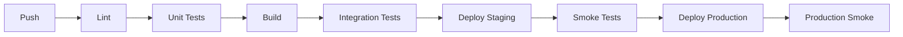

# Testing Strategy

## Testing Philosophy

Correctness in this system means that every document uploaded is either fully processed or explicitly failed with a recoverable state. Local tests validate the logic and integration with emulated AWS services, but they cannot validate production-scale throughput or real-world network jitter.

## Test Types

| Type | Command | Purpose | Production Safe? |
|------|---------|---------|------------------|
| Unit | `npm run test` | Service logic, validators | N/A (no AWS) |
| Integration | `npm run test:integration` | AWS service integration | No (LocalStack) |
| E2E | `node scripts/e2e-test.js` | Full pipeline validation | No |
| Smoke | `npm run test:smoke` | Post-deploy health check | **Yes** |

## Running Tests

### Unit Tests

```bash
npm run test
npm run test:cov  # With coverage
```

**What's tested:**
- PDF chunking algorithms
- Metadata validation
- Gemini response parsing
- State machine transitions

**Expectation:** 100% deterministic behavior. No network calls or AWS dependencies.

### Integration Tests

```bash
# Requires LocalStack running
docker-compose up -d
npm run test:integration
```

**What's tested:**
- End-to-end document lifecycle using LocalStack (S3, DynamoDB, Kinesis)
- Idempotency (re-processing the same chunk)
- Retry logic for simulated transient failures

### E2E Tests

```bash
# 1. Start the application
npm run dev:api-gateway

# 2. Run E2E suite
cd distributed-ml-document-orchestrator
node scripts/e2e-test.js
```

**What's tested:**
1. **Upload**: Submits a PDF to the API
2. **Orchestration**: Verifies job routing to correct workflow
3. **Processing**: Simulates/waits for Gemini analysis
4. **Aggregation**: Polls until document marked `completed`
5. **Verification**: Confirms results available in S3

### Smoke Tests

```bash
# Local
npm run test:smoke

# Production
npm run test:smoke -- --url https://your-alb-url
```

**What's tested:**
- Health endpoint responds with 200
- API accepts requests
- Database connectivity

## Test Configuration

| Parameter | Unit | Integration | E2E |
|-----------|------|-------------|-----|
| Timeout | 5s | 30s | 120s |
| Parallel | Yes | No | No |
| AWS | None | LocalStack | LocalStack |
| Gemini | Mocked | Mocked | Real (optional) |

## CI/CD Pipeline

The pipeline runs tests in stages:



### Pipeline Stages

| Stage | Command | Continues on Failure? |
|-------|---------|----------------------|
| Lint | `npm run lint` | No |
| Unit Tests | `npm run test` | No |
| Build | `npm run build` | No |
| Integration | `npm run test:integration` | No |
| Smoke (Staging) | `npm run test:smoke` | No |
| Deploy Production | `sam deploy` / `terraform apply` | N/A |
| Smoke (Production) | `npm run test:smoke -- --url $PROD_URL` | Triggers rollback |

## Load / Stress Tests (Local)

**Purpose:** Validate system behavior under pressure, not absolute performance metrics.

**What's tested:**
- Burst handling (10+ concurrent uploads)
- Queue growth monitoring
- Backpressure triggers

**Out of Scope:**
- Latency benchmarks
- AWS service limits
- Availability Zone failures

```bash
# Run stress test locally
npm run test:stress
```

## Failure Injection

**Purpose:** Verify system resilience to transient failures.

| Failure Type | Simulation | Expected Response |
|--------------|------------|-------------------|
| Gemini 429 | Mock rate limit response | Retry with backoff |
| Gemini 500 | Mock server error | Retry up to 3 times |
| Consumer crash | `docker stop consumer` | Kinesis resumes from checkpoint |
| Kinesis throttle | LocalStack rate limit | Backpressure triggers |

**Expected System Behavior:**
- Checkpoint progress
- Resume without duplicating results
- No data loss

## Production Validation

> **Note:** Production-scale testing is out of scope for local environments.

### Metrics to Monitor

| Metric | Source | Alert Threshold |
|--------|--------|-----------------|
| `Kinesis.GetRecords.IteratorAgeMilliseconds` | CloudWatch | >60000 (1 min lag) |
| `Gemini.API.ErrorRate` | Custom Metric | >5% |
| `Job.CompletionTime.P99` | Custom Metric | >60s |
| `Lambda.Errors` | CloudWatch | >10 in 5 min |

## Canary Deployment Strategy

### Recommended Approach

1. **Blue-Green with ALB**
   - Deploy new version to separate target group
   - Shift 10% traffic initially
   - Monitor for 5 minutes
   - If healthy, shift 100%

2. **ECS Rolling Update (Default)**
   - Replaces tasks one at a time
   - ALB health checks prevent bad deploys

### Rollback Triggers

| Condition | Action |
|-----------|--------|
| p95 latency > 200ms | Auto-rollback |
| Error rate > 1% | Auto-rollback |
| Health check failures | Auto-rollback |

## Pre-Production Checklist

- [ ] Unit tests pass (`npm run test`)
- [ ] Integration tests pass (`npm run test:integration`)
- [ ] Docker build succeeds (`docker build -t app .`)
- [ ] No `STRESS` or `seed` scripts in deploy
- [ ] Environment variables configured in SSM
- [ ] CloudWatch alarms configured
- [ ] Rollback procedure documented

---
**Note**: Local tests are for functional verification. Performance claims are only valid when measured against production-grade infrastructure.
